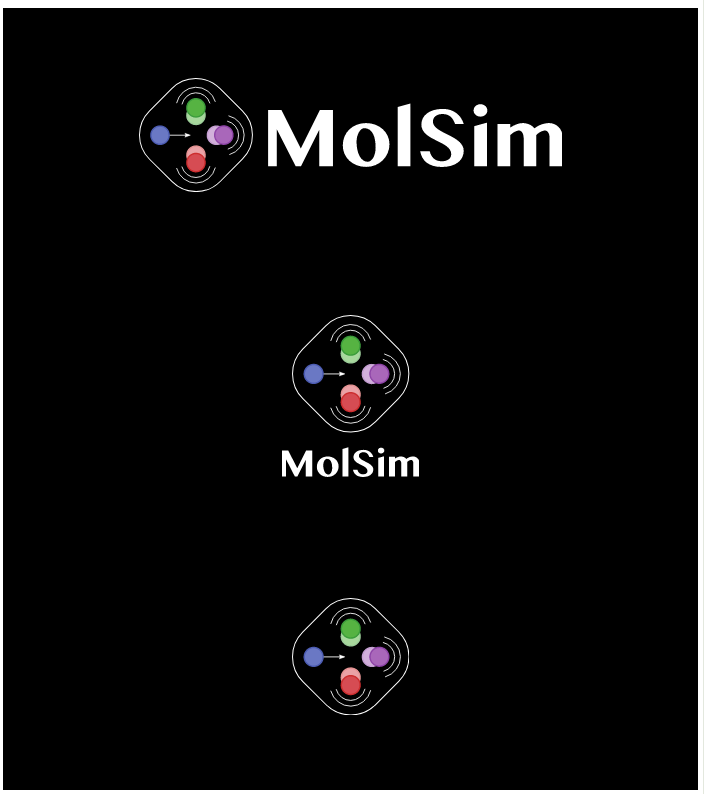

# Logos for light backgrounds:

<table bgcolor="white" width=100% align=center>
<tr><td align=center height=250px>

</td</tr>
<tr><td align=center height=250px>

</td</tr>
<tr><td align=center height=250px>

</td</tr>
</table>

# Logos for dark backgrounds (sample image): 

